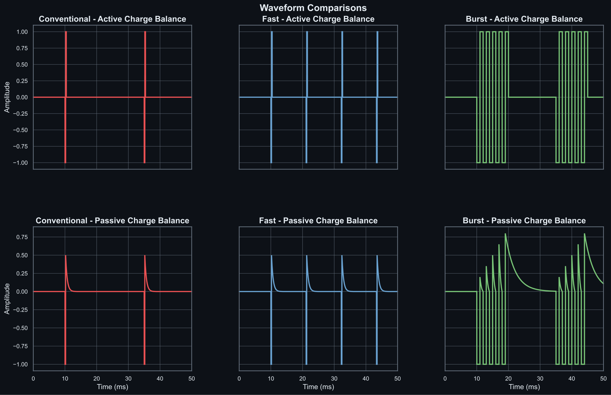
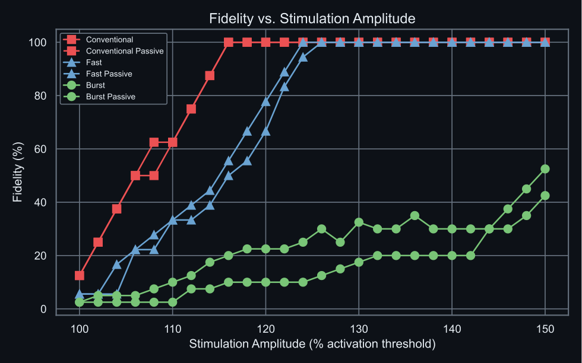

# Neural Responses to Tonic and Burst Stimulation

Research code and selected figures from a computational study of spinal cord stimulation, carried out at Aalborg University and the Grill Lab at Duke University. The study examined how waveform shape and charge balancing affect axonal activation and the fidelity of short-term responses.

**Completed research project.** The repository preserves the simulation and analysis work associated with the paper.

## Publication

**Exploring Tonic and Burst Stimulation in Neural Fibers: A Computational Modeling Approach**

Nickolaj Ajay Atchuthan, Warren M. Grill, and Suzan Meijs. IEEE EMBC, 2025, pp. 1–6.

[Read the paper on IEEE Xplore](https://ieeexplore.ieee.org/abstract/document/11253067) · [DOI](https://doi.org/10.1109/EMBC58623.2025.11253067)

## Research question and approach

How do tonic and burst stimulation recruit modelled fibres, and how reliably does each stimulus produce a propagating action potential?

The study used a modified McIntyre–Richardson–Grill axon model through PyFibers. Simulations compared conventional, FAST, and burst waveforms, active and passive charge balancing, different fibre diameters, and two pulse-width settings (0.2 and 1 ms).



*Waveform illustration retained from the project. Amplitudes are normalised; this panel shows the stimulation shapes rather than activation thresholds.*

## Main findings

The [paper](https://ieeexplore.ieee.org/abstract/document/11253067) reports:

- Burst waveforms had lower activation thresholds than conventional and FAST stimulation, particularly for smaller fibres.
- Burst responses reached approximately **43–53% fidelity at 150% of activation threshold**. Conventional and FAST responses reached **100% fidelity at 116% and 124% of threshold**, respectively.
- Burst stimulation produced irregular intraburst firing and both uni- and bidirectional propagation, while conventional and FAST responses were more consistently pulse-locked.

These modelling results suggest that differences in firing regularity may help explain reduced paraesthesia with burst stimulation. They provide a proposed mechanism; clinical effects were not measured in these simulations.



*Saved amplitude-sweep output for a 4 µm fibre over a 200 ms simulation window. The source counts, simulation parameters, and figure provenance are in [docs/figures](docs/figures/). These are retained project outputs with colours adapted for a dark background; the original SVGs are preserved.*

## Code and supporting material

| Path | Contents |
| --- | --- |
| `functions/waveforms.py` | Waveform definitions used in the experiments |
| `pipelines/` | Fibre simulations, threshold searches, and plotting scripts |
| `pipelines/tables/` | Historical threshold exports |
| `prototyping/` | Exploratory work retained for context |
| `docs/figures/` | Selected figures with source data and provenance |

The scripts reflect the research environment in which they were written. Full simulations require the original compatible PyFibers/NEURON mechanisms, whose exact versions are not pinned here. Historical scripts also contain local paths and run-specific parameters. The publication is the reference for the study methods and conclusions.

A small waveform preview and synthetic checks are available independently of the fibre simulator:

```sh
python -m pip install -r requirements.txt
python -m examples.waveform_preview --output outputs/waveforms.png
python -m unittest discover -s tests -v
```

These checks cover software behaviour, not reproduction of the paper's results. The waveform conventions have been preserved, including historical differences in gap placement and burst timing between generators.
